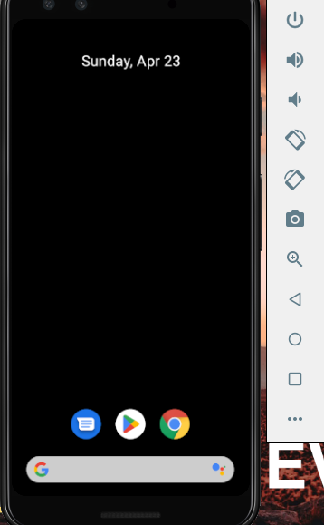
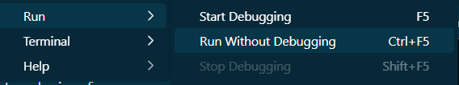
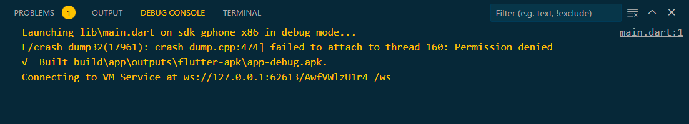
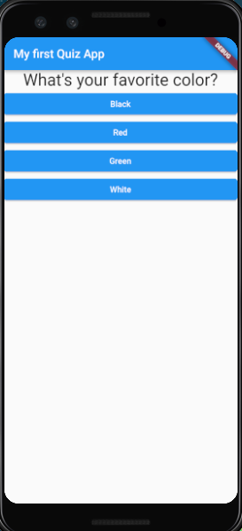

# Flutter Quiz App

A simple flutter quiz app as an introduction to flutter

## Running the app

1. Start the Android Emulator 
2. 

    
3. The emulator has started
4.  
   
5. Select the emulator device from your vscode panel (Like here I've selected Pixel 3) 

6. 

7. Open the main.dart file

8. Go to Run > Run without Debugging
   
   
   
9. Wait for the App to be built

10. 
    
11. Attend the Quiz
   
12. 

13. The final result

15. 
## Future Plan

Adding the score calculating functionality to the app
